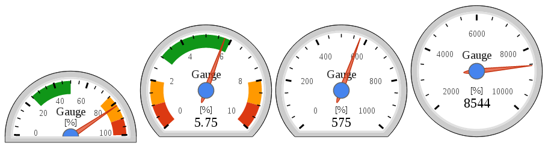

# d3-radial-gauge

This is my implementation of radial gauge using javascript library D3.js. It improves on the original versions and adds more options. See preview. It also follows the D3's Towards Reusable Charts guide so the code of the gauge is much better encapsulated. 

It inspired by Google's radial gauge and tomerd's work with D3.js

[Google's version](https://developers.google.com/chart/interactive/docs/gallery/gauge?hl=en)

[Tomerd's GIST](https://gist.github.com/tomerd/1499279)

[Towards Reusable Charts guide](http://bost.ocks.org/mike/chart/)

## State of the project

At this stage there are few versions of the Gauge with optimized look, but it can be still improved a lot. For updating the gauge, there is a lot of space for improvements as well. Now it just removes everything and draws everything again. Also there is no implementation of transitions yet. Transions are not my priority so it is up to you. Get some inspiration at Tomerd's GIST, but my version is very differnt now. 

